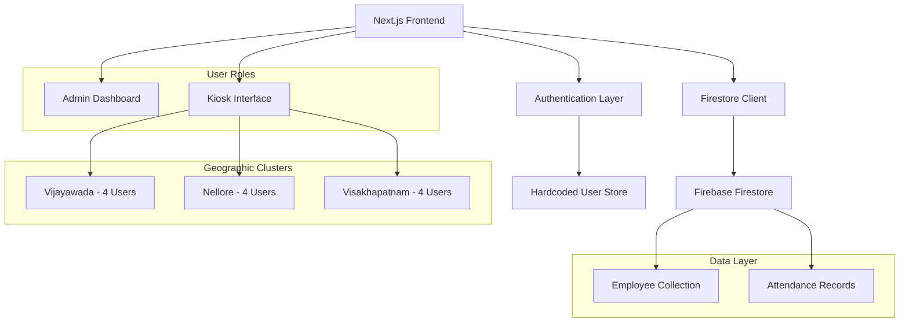
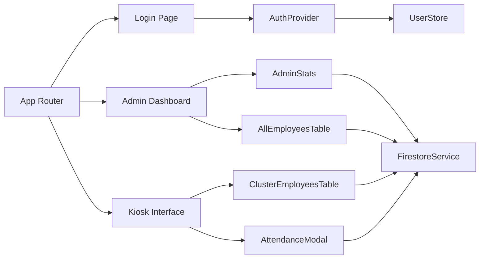

# Design Document

## Overview

The Employee Family Attendance system is a role-based web application built on Next.js with Firebase Firestore backend. It transforms the existing student attendance interface into a comprehensive family attendance management system supporting admin oversight and kiosk-based attendance marking across multiple geographic clusters.

The system architecture separates concerns between authentication, data management, and user interface layers while maintaining the existing visual design and animation framework. Key components include SHA-based authentication, real-time Firestore integration, cluster-based data filtering, and dynamic family member management with name entry capabilities.

## Architecture

### System Architecture



### Component Architecture



## Components and Interfaces

### Authentication System

**AuthProvider Component**
- Manages user authentication state
- Validates SHA-hashed passwords against hardcoded credentials
- Provides user context (role, cluster, username) throughout application
- Handles login/logout functionality

**UserStore Interface**
```typescript
interface KioskUser {
  username: string;
  passwordHash: string; // SHA-256 hash
  cluster: 'Vijayawada' | 'Nellore' | 'Visakhapatnam';
  displayName: string;
}

interface AdminUser {
  username: string;
  passwordHash: string;
  role: 'admin';
}
```

### Data Management Layer

**FirestoreService**
- Handles all Firestore operations (read/write)
- Manages real-time subscriptions for attendance updates
- Provides cluster-filtered employee queries
- Handles attendance record creation and updates

**Employee Interface**
```typescript
interface Employee {
  empId: string;
  name: string;
  cluster: string;
  eligibility: string;
  eligibleChildrenCount: number;
  kids: Array<{
    name: string;
    ageBracket: string;
  }>;
  attendance?: {
    employee: boolean;
    spouse: boolean;
    kid1: boolean;
    kid2: boolean;
    kid3: boolean;
  };
}
```

**AttendanceRecord Interface**
```typescript
interface AttendanceRecord {
  employee: boolean;
  spouse: boolean;
  kid1: boolean;
  kid2: boolean;
  kid3: boolean;
  markedBy: string;
  markedAt: Timestamp;
  kidNames?: {
    kid1?: string;
    kid2?: string;
    kid3?: string;
  };
}
```

### User Interface Components

**AdminDashboard**
- Real-time statistics display for all clusters
- Aggregated attendance counts (total, present, pending)
- Cluster-wise breakdown with visual charts
- All-employees table with global search and filtering

**KioskInterface**
- Cluster-specific employee table
- Search and filter functionality within assigned cluster
- Attendance marking modal integration
- Real-time updates for marked attendance

**AttendanceModal**
- Dynamic family member toggles based on employee data
- Input fields for missing children names
- Real-time preview of marking information
- Confirmation and save functionality

## Data Models

### Firestore Collections

**employees Collection**
```
/employees/{empId}
{
  empId: string,
  name: string,
  cluster: string,
  eligibility: string,
  eligibleChildrenCount: number,
  kids: [
    { name: string, ageBracket: string },
    { name: string, ageBracket: string },
    { name: string, ageBracket: string }
  ]
}
```

**attendance Collection**
```
/attendance/event/records/{empId}
{
  employee: boolean,
  spouse: boolean,
  kid1: boolean,
  kid2: boolean,
  kid3: boolean,
  markedBy: string,
  markedAt: Timestamp,
  kidNames: {
    kid1?: string,
    kid2?: string,
    kid3?: string
  }
}
```

### Hardcoded User Arrays

**Kiosk Users Configuration**
```typescript
const KIOSK_USERS: KioskUser[] = [
  // Vijayawada Users
  { username: 'vja_user1', passwordHash: 'sha256_hash_1', cluster: 'Vijayawada', displayName: 'Vijayawada Kiosk 1' },
  { username: 'vja_user2', passwordHash: 'sha256_hash_2', cluster: 'Vijayawada', displayName: 'Vijayawada Kiosk 2' },
  { username: 'vja_user3', passwordHash: 'sha256_hash_3', cluster: 'Vijayawada', displayName: 'Vijayawada Kiosk 3' },
  { username: 'vja_user4', passwordHash: 'sha256_hash_4', cluster: 'Vijayawada', displayName: 'Vijayawada Kiosk 4' },
  
  // Nellore Users
  { username: 'nel_user1', passwordHash: 'sha256_hash_5', cluster: 'Nellore', displayName: 'Nellore Kiosk 1' },
  { username: 'nel_user2', passwordHash: 'sha256_hash_6', cluster: 'Nellore', displayName: 'Nellore Kiosk 2' },
  { username: 'nel_user3', passwordHash: 'sha256_hash_7', cluster: 'Nellore', displayName: 'Nellore Kiosk 3' },
  { username: 'nel_user4', passwordHash: 'sha256_hash_8', cluster: 'Nellore', displayName: 'Nellore Kiosk 4' },
  
  // Visakhapatnam Users
  { username: 'vsk_user1', passwordHash: 'sha256_hash_9', cluster: 'Visakhapatnam', displayName: 'Visakhapatnam Kiosk 1' },
  { username: 'vsk_user2', passwordHash: 'sha256_hash_10', cluster: 'Visakhapatnam', displayName: 'Visakhapatnam Kiosk 2' },
  { username: 'vsk_user3', passwordHash: 'sha256_hash_11', cluster: 'Visakhapatnam', displayName: 'Visakhapatnam Kiosk 3' },
  { username: 'vsk_user4', passwordHash: 'sha256_hash_12', cluster: 'Visakhapatnam', displayName: 'Visakhapatnam Kiosk 4' }
];

const ADMIN_USER: AdminUser = {
  username: 'admin',
  passwordHash: 'admin_sha256_hash',
  role: 'admin'
};
```

## Correctness Properties

*A property is a characteristic or behavior that should hold true across all valid executions of a system-essentially, a formal statement about what the system should do. Properties serve as the bridge between human-readable specifications and machine-verifiable correctness guarantees.*

### Property Reflection

After analyzing all acceptance criteria, several properties can be consolidated to eliminate redundancy:

- Authentication properties (1.2, 1.3, 1.4, 8.4) can be combined into comprehensive authentication behavior
- Data filtering properties (2.1, 6.2, 7.4) share similar validation patterns for cluster-based access
- UI state management properties (3.1, 3.2, 5.1, 5.3) test similar modal behavior patterns
- Audit trail properties (1.5, 5.5, 8.5) all validate user tracking in attendance records

### Core Properties

**Property 1: Authentication and Authorization**
*For any* valid kiosk user credentials, authentication should succeed and grant access only to the user's assigned cluster data, while invalid credentials should be rejected with appropriate error messaging
**Validates: Requirements 1.2, 1.3, 1.4, 8.4**

**Property 2: Cluster-based Data Access**
*For any* authenticated kiosk user, the system should only display and allow interaction with employees from their assigned geographic cluster
**Validates: Requirements 2.1, 7.4**

**Property 3: Employee Data Display Completeness**
*For any* employee record, the system should display all required fields (empId, name, eligibility, attendance status) and handle missing data gracefully with appropriate placeholders
**Validates: Requirements 2.2, 2.3**

**Property 4: Modal Attendance Interface**
*For any* employee row interaction, the system should open a modal displaying toggles for employee, spouse, and up to 3 children, with dynamic name input fields when children data is incomplete
**Validates: Requirements 3.1, 3.2, 3.3, 3.4, 3.5**

**Property 5: Attendance Data Persistence**
*For any* attendance marking operation, the system should write data to the correct Firestore path `/attendance/event/records/{empId}` and update employee records with any dynamically entered children names
**Validates: Requirements 4.1, 4.2**

**Property 6: UI State Synchronization**
*For any* successful attendance save operation, the system should immediately update the employee row visual state and display appropriate confirmation messaging
**Validates: Requirements 4.3, 4.4**

**Property 7: Attendance History Management**
*For any* previously marked employee, reopening their attendance modal should display current values pre-selected with appropriate button text changes and preserve audit trail information
**Validates: Requirements 5.1, 5.2, 5.3, 5.4**

**Property 8: Search and Filter Functionality**
*For any* search input within a kiosk user's cluster, the system should filter employees in real-time by name or employee ID while maintaining eligibility as display-only information
**Validates: Requirements 6.2, 6.3**

**Property 9: Admin Dashboard Completeness**
*For any* admin user access, the system should display comprehensive statistics for all clusters including total members, attendance counts, and real-time updates from kiosk operations
**Validates: Requirements 7.1, 7.2, 7.3, 7.5**

**Property 10: User Configuration Integrity**
*For any* system deployment, the hardcoded user arrays should contain exactly 4 kiosk users per cluster (Vijayawada, Nellore, Visakhapatnam) with proper SHA-hashed credentials and correct cluster assignments
**Validates: Requirements 8.1, 8.2, 8.3**

**Property 11: Audit Trail Consistency**
*For any* attendance operation, the system should record the authenticated user's identifier in the "markedBy" field and maintain audit trail integrity across updates
**Validates: Requirements 1.5, 5.5, 8.5**

## Error Handling

### Authentication Errors
- Invalid credentials: Display clear error message and prevent system access
- Network failures during authentication: Provide retry mechanisms
- Session timeout: Redirect to login with appropriate messaging

### Data Access Errors
- Firestore connection failures: Show error state with retry options
- Missing employee data: Display placeholders and allow graceful degradation
- Incomplete family data: Provide input fields for dynamic name entry

### Attendance Marking Errors
- Save operation failures: Show error toast and maintain form state for retry
- Concurrent modification conflicts: Implement optimistic updates with conflict resolution
- Network interruptions: Queue operations for retry when connection restored

### UI Error States
- Empty search results: Display "no employees found" messaging
- Loading states: Show appropriate spinners and skeleton screens
- Modal errors: Provide clear error messaging within modal context

## Testing Strategy

### Unit Testing Approach
The system will use Jest and React Testing Library for unit tests focusing on:
- Component rendering with various props and states
- User interaction handlers (clicks, form submissions)
- Data transformation and validation functions
- Error boundary behavior and fallback states

### Property-Based Testing Approach
The system will use fast-check (JavaScript property-based testing library) for comprehensive property validation:
- Each correctness property will be implemented as a property-based test
- Tests will run a minimum of 100 iterations to ensure statistical confidence
- Generators will create realistic test data including edge cases
- Properties will be tagged with explicit references to design document properties

**Property-Based Testing Configuration:**
- Library: fast-check for JavaScript/TypeScript
- Minimum iterations: 100 per property test
- Test tagging format: `**Feature: employee-family-attendance, Property {number}: {property_text}**`
- Generator strategy: Smart generators that constrain to realistic input spaces

**Dual Testing Benefits:**
- Unit tests catch specific bugs and verify concrete examples
- Property tests verify universal correctness across input ranges
- Together they provide comprehensive coverage of both specific cases and general behavior
- Property tests help discover edge cases that unit tests might miss